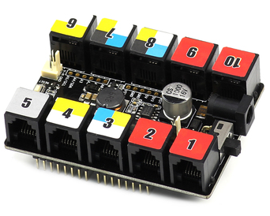

# Makeblock Me UNO Shield

---

## Description
The [Makeblock ME UNO Shield module](http://learn.makeblock.com/en/me-uno-shield/) is a shield of Arduino UNO. It can turn Arduino pins into Makeblock RJ25 ports. You can connect Arduino UNO with Makeblock electronic modules. This shield provides a stable power, so it can drive many servos and motors.

---

## Features
* 2.54mm pin holes for connecting with Dupont wire
* Easy wiring with 6P6C RJ25 interface
* [Arduino library](https://github.com/Makeblock-official/Makeblock-Libraries) for easy programming

---

## Specification
* Rated Voltage: 6V – 12V
* Rated Current: 1.5A

## Schematic

---
